# Architecture Diagrams

This document gives you:

1. A readable UML class/object view of the main runtime objects in the repo.
2. A sequence diagram for the active workout logging flow.
3. A full exported-object inventory grouped by source area so the visual diagram can stay readable.

## Scope note

This codebase has dozens of pages and components. A literal single-canvas diagram of every exported object would be too dense to use, so the UML below groups the object graph by subsystem and highlights the objects that actively collaborate at runtime.

Important architectural note discovered during generation:

- The active frontend workout save flow writes canonical workout events to `users/{uid}/workoutEvents/{eventId}`.
- The app also regenerates `users/{uid}/workoutLogs/{date}` as a derived per-day history projection from those canonical events.
- The workout history page now reads canonical `users/{uid}/workoutEvents/{eventId}` records directly.
- The legacy `workoutSessions/{sessionId}` trigger has been retired so non-authoritative paths are no longer watched.
- The authoritative workout domain contract now lives in `shared/models/workout-event.model.ts`.
- See `docs/workout-event-model.md` for the canonical workout shape and legacy adapter mapping.

## UML Class Diagram

```mermaid
classDiagram
direction LR

namespace Frontend_Pages {
  class WorkoutChatbotPage
  class WorkoutSummaryPage
  class GroupsPage
  class LeaderboardPage
  class ChatDetailPage
  class ClientFindTrainerPage
  class TrainerCalendarPage
  class ProfileSettingsPage
}

namespace Frontend_Services {
  class WorkoutChatService
  class WorkoutLogService
  class WorkoutSessionFormatterService
  class UpdateScoreService
  class ExerciseEstimatorsService
  class GroupService
  class LeaderboardService
  class ChatsService
  class NotificationService
  class UserBadgesService
  class GreekStatuesService
  class UserStatsService
  class AccountService
  class ProfileRepositoryService
  class TrainerFinderService
  class TrainerAvailabilityService
  class BookingService
  class SessionNotesService
  class VideoAnalysisService
  class AccountUserService
  class LegacyUserService
}

namespace Domain_Models {
  class WorkoutSessionPerformance {
    +date: string
    +trainingRows: WorkoutTrainingRow[]
    +strengthTrainingRow: WorkoutTrainingRow[]
    +cardioTrainingRow: CardioTrainingRow[]
    +otherTrainingRow: OtherTrainingRow[]
    +estimated_calories: number
    +trainer_notes: string
    +isComplete: boolean
  }

  class WorkoutTrainingRow {
    +Training_Type: TrainingType
    +exercise_type: string
    +sets: number
    +reps: number
    +displayed_weights_metric: string
    +weights_kg: number
    +estimated_calories: number
  }

  class CardioTrainingRow {
    +Training_Type: Cardio
    +cardio_type: string
    +display_distance: string
    +display_time: string
    +distance_meters: number
    +time_minutes: number
    +estimated_calories: number
  }

  class OtherTrainingRow {
    +Training_Type: Other
    +estimated_calories: number
  }

  class UserStats {
    +userId: string
    +userScore: UserScore
    +Expected_Effort: ExpectedEffortMap
    +streakData: StreakData
    +groupRankings: GroupRankingsMap
    +region: Region
  }

  class UserScore {
    +cardioScore: CardioScoreMap
    +strengthScore: StrengthScoreMap
    +totalScore: number
    +maxAddedScoreWithinDay: number
  }

  class AppUser {
    +userId: string
    +email: string
    +firstName: string
    +lastName: string
    +groupID: string[]
    +trainerId: string
    +isPT: boolean
  }

  class Group {
    +groupId: string
    +name: string
    +ownerUserId: string
    +userIDs: string[]
    +isPTGroup: boolean
  }

  class Chat {
    +chatId: string
    +participants: string[]
    +lastMessage: string
    +lastMessageTime: string
    +messages: message map
  }

  class Message {
    +senderId: string
    +text: string
    +timestamp: string
    +read: boolean
  }

  class ExerciseEstimatorDoc {
    +id: string
    +model: ExerciseEstimatorModel
    +coefficients: ExerciseEstimatorCoefficientMap
  }

  class GreekStatueDefinition {
    +id: string
    +title: string
    +category: StatueCategory
    +tiers: tier map
  }

  class UserBadgeStatDoc {
    +currentLevel: UserBadgeLevel
    +currentValue: number
    +nextTierValue: number
    +progressToNext: number
    +isDisplayed: boolean
  }
}

namespace Backend_Functions {
  class WorkoutChatCallable
  class TreadmillLoggerCallable
  class MergeWorkoutNotesCallable
  class RetrainExerciseEstimatorOnWorkoutLogCreate
  class OnBookingChange
  class OnTrainerClientChange
  class OnWorkoutSessionCreate
}

namespace Infrastructure {
  class Firestore
  class RealtimeDatabase
  class OpenAI
}

WorkoutSessionPerformance o-- WorkoutTrainingRow
WorkoutSessionPerformance o-- CardioTrainingRow
WorkoutSessionPerformance o-- OtherTrainingRow
UserStats o-- UserScore
Chat o-- Message

WorkoutChatbotPage --> WorkoutChatService : sendMessage()
WorkoutChatbotPage --> WorkoutLogService : saveCompletedWorkout()
WorkoutChatbotPage --> ExerciseEstimatorsService : getCachedEstimatorIds()
WorkoutChatbotPage --> WorkoutSessionFormatterService : normalize session state
WorkoutSummaryPage --> WorkoutSessionPerformance

GroupsPage --> GroupService
LeaderboardPage --> LeaderboardService
ChatDetailPage --> ChatsService
ClientFindTrainerPage --> TrainerFinderService
TrainerCalendarPage --> TrainerAvailabilityService
TrainerCalendarPage --> BookingService
ProfileSettingsPage --> AccountService
ProfileSettingsPage --> AccountUserService

AccountService --> GroupService
AccountService --> Firestore
AccountUserService --> AccountService
AccountUserService --> ProfileRepositoryService
AccountUserService --> UserBadgesService
AccountUserService --> UserStatsService
LegacyUserService --> Firestore
ProfileRepositoryService --> Firestore
ProfileRepositoryService --> AppUser

GroupService --> ProfileRepositoryService
GroupService --> Group
LeaderboardService --> AccountUserService
LeaderboardService --> ProfileRepositoryService
LeaderboardService --> UserStats

WorkoutLogService --> WorkoutSessionFormatterService
WorkoutLogService --> UpdateScoreService
WorkoutLogService --> ChatsService
WorkoutLogService --> WorkoutSessionPerformance
WorkoutLogService --> Firestore

WorkoutSessionFormatterService --> ExerciseEstimatorsService
UpdateScoreService --> ExerciseEstimatorDoc
UpdateScoreService --> UserStats
UpdateScoreService --> Firestore
ExerciseEstimatorsService --> ExerciseEstimatorDoc
ExerciseEstimatorsService --> Firestore

ChatsService --> RealtimeDatabase
ChatsService --> AccountUserService
ChatsService --> NotificationService
ChatsService --> Chat

UserBadgesService --> GreekStatuesService
UserBadgesService --> UserBadgeStatDoc
UserBadgesService --> Firestore
GreekStatuesService --> GreekStatueDefinition
GreekStatuesService --> Firestore
UserStatsService --> UserStats
UserStatsService --> Firestore
SessionNotesService --> Firestore
VideoAnalysisService --> WorkoutSessionPerformance

WorkoutChatService --> WorkoutChatCallable
WorkoutChatService --> TreadmillLoggerCallable
WorkoutChatService --> MergeWorkoutNotesCallable

WorkoutChatCallable --> OpenAI
TreadmillLoggerCallable --> OpenAI
MergeWorkoutNotesCallable --> OpenAI

RetrainExerciseEstimatorOnWorkoutLogCreate --> Firestore
OnBookingChange --> Firestore
OnTrainerClientChange --> Firestore
OnWorkoutSessionCreate ..> Firestore : listens to legacy path
```



## Sequence Diagram

This sequence reflects the active workout-chat-to-save flow implemented in the current app.

```mermaid
sequenceDiagram
autonumber

actor User
participant Page as WorkoutChatbotPage
participant ChatSvc as WorkoutChatService
participant ChatFn as workoutChatCallable
participant OpenAI
participant EstSvc as ExerciseEstimatorsService
participant LogSvc as WorkoutLogService
participant Formatter as WorkoutSessionFormatterService
participant ScoreSvc as UpdateScoreService
participant FS as Firestore
participant ChatDbSvc as ChatsService
participant RTDB as Realtime Database
participant RetrainFn as retrainExerciseEstimatorOnWorkoutLogCreate

User->>Page: Enter workout message
Page->>ChatSvc: sendMessage(message, session, history, estimatorIds)
ChatSvc->>ChatFn: httpsCallable(payload)
ChatFn->>OpenAI: Parse/update workout JSON
OpenAI-->>ChatFn: assistantMessage + summary
ChatFn-->>ChatSvc: ChatResponse
ChatSvc-->>Page: botMessage + updatedSession
Page->>EstSvc: ensure estimator docs for strength rows
EstSvc->>FS: Read/create exercise estimator docs

User->>Page: Submit workout
Page->>LogSvc: saveCompletedWorkout(session)
LogSvc->>Formatter: normalizeSession(session)
Formatter-->>LogSvc: normalized session

LogSvc->>FS: Write users/{uid}/workoutEvents/{eventId}
LogSvc->>FS: Refresh users/{uid}/workoutLogs/{date} derived day projection
LogSvc->>FS: Transactionally update userStats streak + early-morning tracker
LogSvc->>ScoreSvc: updateScoreAfterWorkout(userId, event, workoutEventId)
ScoreSvc->>FS: Read userStats, users doc, estimator docs
ScoreSvc->>FS: Write score totals, expected effort, rankings, estimator workout_logs

par Trainer summary collection
  LogSvc->>FS: Add users/{trainerUid}/workoutSummaries document
and Chat summary message
  LogSvc->>ChatDbSvc: findOrCreateDirectChat(trainerUid, clientUid)
  ChatDbSvc->>RTDB: Read/create chat
  LogSvc->>ChatDbSvc: sendMessage(chatId, clientUid, summaryText)
  ChatDbSvc->>RTDB: Persist chat message + unread counters
end

FS-->>RetrainFn: Trigger when estimator workout_logs doc is created
RetrainFn->>FS: Retrain and persist estimator coefficients/metrics

Note over LogSvc,FS: Canonical frontend path persists to users/{uid}/workoutEvents/{eventId}; workoutLogs/{date} is a temporary legacy projection

LogSvc-->>Page: savedSession + streakUpdate + scoreUpdate
Page-->>User: Success message + workout summary
```

## Exported Object Inventory

The lists below map exported objects back to their source areas. This is the full index used to derive the grouped UML.

### Frontend services

- `src/app/services/account/account.service.ts`: `AccountService`
- `src/app/services/account/profile-repository.service.ts`: `ProfileRepositoryService`
- `src/app/services/account/user.service.ts`: `UserService`
- `src/app/services/app-version.ts`: `AppVersionService`
- `src/app/services/attachment.service.ts`: `AttachmentService`
- `src/app/services/auth.service.ts`: `AuthService`
- `src/app/services/booking.service.ts`: `BookingService`
- `src/app/services/chats.service.ts`: `ChatsService`
- `src/app/services/deep-link.service.ts`: `DeepLinkService`
- `src/app/services/exercise-estimators.service.ts`: `ExerciseEstimatorsService`
- `src/app/services/file-upload.service.ts`: `FileUploadService`
- `src/app/services/google-analytics.service.ts`: `GoogleAnalyticsService`
- `src/app/services/greek-statues.service.ts`: `GreekStatuesService`
- `src/app/services/group.service.ts`: `GroupService`
- `src/app/services/image-picker.service.ts`: `ImagePickerService`
- `src/app/services/leaderboard.service.ts`: `LeaderboardService`
- `src/app/services/notes.service.ts`: `NotesService`
- `src/app/services/notification.service.ts`: `NotificationService`
- `src/app/services/session-booking.service.ts`: `SessionBookingService`
- `src/app/services/agreement.service.ts`: `SessionBookingService`
- `src/app/services/session-notes.service.ts`: `SessionNotesService`
- `src/app/services/trainer-availability.service.ts`: `TrainerAvailabilityService`
- `src/app/services/trainer-finder.service.ts`: `TrainerFinderService`
- `src/app/services/update-score.service.ts`: `UpdateScoreService`
- `src/app/services/user-badges.service.ts`: `UserBadgesService`
- `src/app/services/user-stats.service.ts`: `UserStatsService`
- `src/app/services/user.service.ts`: `UserService`
- `src/app/services/video-analysis.service.ts`: `VideoAnalysisService`
- `src/app/services/workout-chat.service.ts`: `WorkoutChatService`
- `src/app/services/workout-log.service.ts`: `WorkoutLogService`
- `src/app/services/workout-session-formatter.service.ts`: `WorkoutSessionFormatterService`

### Frontend pages

- `src/app/pages/account/trainer-account/trainer-account.page.ts`: `AccountPage`
- `src/app/pages/account/client-account/client-account.page.ts`: `ClientAccountPage`
- `src/app/pages/calender/calendar.page.ts`: `CalendarPage`
- `src/app/pages/calender/client-calendar/client-calendar.page.ts`: `ClientCalendarPage`
- `src/app/pages/calender/trainer-calendar/trainer-calendar.page.ts`: `TrainerCalendarPage`
- `src/app/pages/camera/camera.page.ts`: `CameraPage`
- `src/app/pages/chats/chats.page.ts`: `ChatsPage`
- `src/app/pages/chats/chat-detail/chat-detail.page.ts`: `ChatDetailPage`
- `src/app/pages/chats/client-chats/client-chats.page.ts`: `ClientChatsPage`
- `src/app/pages/client-details/client-details.page.ts`: `ClientDetailsPage`
- `src/app/pages/client-find-trainer/client-find-trainer.page.ts`: `ClientFindTrainerPage`
- `src/app/pages/complete-profile/complete-profile.page.ts`: `CompleteProfilePage`
- `src/app/pages/delete-account/delete-account.page.ts`: `DeleteAccountPage`
- `src/app/pages/group-settings/group-settings.page.ts`: `GroupSettingsPage`
- `src/app/pages/groups/groups.page.ts`: `GroupsPage`
- `src/app/pages/home/home.page.ts`: `HomePage`
- `src/app/pages/leaderboards/leaderboard/leaderboard.page.ts`: `LeaderboardPage`
- `src/app/pages/leaderboards/regional-leaderboard/regional-leaderboard.page.ts`: `RegionalLeaderboardPage`
- `src/app/pages/live-session/live-session.page.ts`: `LiveSessionPage`
- `src/app/pages/logging-method-routes/logging-method-routes.page.ts`: `LoggingMethodRoutesPage`
- `src/app/pages/login/login.page.ts`: `LoginPage`
- `src/app/pages/map-tracking-logger/map-tracking-logger.page.ts`: `MapTrackingLoggerPage`
- `src/app/pages/profile-creation/profile-creation.page.ts`: `ProfileCreationPage`
- `src/app/pages/profile-creation/profile-create-client/profile-create-client.page.ts`: `ProfileCreateClientPage`
- `src/app/pages/profile-creation/profile-create-trainer/profile-create-trainer.page.ts`: `ProfileCreateTrainerPage`
- `src/app/pages/profile-settings/profile-settings.page.ts`: `ProfileSettingsPage`
- `src/app/pages/profile-user/profile-user.page.ts`: `ProfileUserPage`
- `src/app/pages/profiles/client-profile/client-profile.page.ts`: `ClientProfilePage`
- `src/app/pages/sign-up/sign-up.page.ts`: `SignUpPage`
- `src/app/pages/statues-dashbord/statues-dashbord.page.ts`: `StatuesDashbordPage`
- `src/app/pages/tabs/tabs.page.ts`: `TabsPage`
- `src/app/pages/treadmill-logger/treadmill-logger.page.ts`: `TreadmillLoggerPage`
- `src/app/pages/workout-chatbot/workout-chatbot.page.ts`: `WorkoutChatbotPage`
- `src/app/pages/workout-details/workout-details.page.ts`: `WorkoutDetailsPage`
- `src/app/pages/workout-history/workout-history.page.ts`: `WorkoutHistoryPage`
- `src/app/pages/workout-history-csv/workout-history-csv.page.ts`: `WorkoutHistoryCsvPage`
- `src/app/pages/workout-insights/workout-insights.page.ts`: `WorkoutInsightsPage`
- `src/app/pages/workout-summary/workout-summary.page.ts`: `WorkoutSummaryPage`

### Frontend components

- `src/app/components/achievement-badge/achievement-badge.component.ts`: `AchievementBadgeComponent`
- `src/app/components/agreements/agreement-modal/agreement-modal.component.ts`: `AgreementModalComponent`
- `src/app/components/agreements/service-agreement/service-agreement.component.ts`: `ServiceAgreementComponent`
- `src/app/components/availabilty/availabilty.component.ts`: `AvailabiltyComponent`
- `src/app/components/background-gradients/background-gradients.component.ts`: `BackgroundGradientsComponent`
- `src/app/components/badge-selector/badge-selector.component.ts`: `BadgeSelectorComponent`
- `src/app/components/blue-circle-gradient/blue-circle-gradient.component.ts`: `BlueCircleGradientComponent`
- `src/app/components/booking-message/booking-message.component.ts`: `BookingMessageComponent`
- `src/app/components/certifications/certifications.component.ts`: `CertificationsComponent`
- `src/app/components/file-preview/file-preview.component.ts`: `FilePreviewComponent`
- `src/app/components/greek-statue/greek-statue.component.ts`: `GreekStatueComponent`
- `src/app/components/header/header.component.ts`: `HeaderComponent`
- `src/app/components/image-carousel/image-carousel.component.ts`: `ImageCarouselComponent`
- `src/app/components/image-uploader/image-uploader.component.ts`: `ImageUploaderComponent`
- `src/app/components/leaderboard-shell/leaderboard-shell.component.ts`: `LeaderboardShellComponent`
- `src/app/components/modals/appointment-scheduler-modal/appointment-scheduler-modal.component.ts`: `AppointmentSchedulerModalComponent`
- `src/app/components/modals/home-customization-modal/home-customization-modal.component.ts`: `HomeCustomizationModalComponent`
- `src/app/components/modals/workout-builder-modal/workout-builder-modal.component.ts`: `WorkoutBuilderModalComponent`
- `src/app/components/password-change-modal/password-change-modal.component.ts`: `PasswordChangeModalComponent`
- `src/app/components/payment-received-item/payment-received-item.component.ts`: `PaymentReceivedItemComponent`
- `src/app/components/phone-input/phone-input.component.ts`: `PhoneInputComponent`
- `src/app/components/search-modal/search-modal.component.ts`: `SearchModalComponent`
- `src/app/components/sessions/list-session-notes/list-session-notes.component.ts`: `ListSessionNotesComponent`
- `src/app/components/sessions/list-sessions/list-sessions.component.ts`: `ListSessionsComponent`
- `src/app/components/sessions/modal-session-cancel/modal-session-cancel.component.ts`: `ModalSessionCancelComponent`
- `src/app/components/sessions/session-notes/session-notes.component.ts`: `SessionNotesComponent`
- `src/app/components/sessions/session-reschedule-message/session-reschedule-message.component.ts`: `SessionRescheduleMessageComponent`
- `src/app/components/statue-selector/statue-selector.component.ts`: `StatueSelectorComponent`
- `src/app/components/time-picker-modal/time-picker-modal.component.ts`: `TimePickerModalComponent`
- `src/app/components/tool-tip/tool-tip.component.ts`: `ToolTipComponent`
- `src/app/components/video-uploader/video-uploader.component.ts`: `VideoUploaderComponent`

### Models and interfaces

- `src/app/models/workout-session.model.ts`: `ExerciseSet`, `ExerciseLog`, `SummaryExercise`, `TrainingType`, `RowWeight`, `WorkoutTrainingRow`, `CardioRoutePoint`, `CardioRouteBounds`, `CardioTrainingRow`, `OtherTrainingRow`, `WorkoutSessionPerformance`
- `src/app/models/user-stats.model.ts`: `Region`, `CardioScoreMap`, `StrengthScoreMap`, `UserScore`, `ExpectedEffortCategoryMap`, `ExpectedEffortMap`, `StreakData`, `EarlyMorningWorkoutsTracker`, `GroupRankingsMap`, `UserStats`, `UserLevelProgress`, `AddedScoreDaily`
- `src/app/models/exercise-estimators.model.ts`: `ExerciseEstimatorModel`, `ExerciseEstimatorCategory`, `EXERCISE_ESTIMATOR_ROOT_COLLECTION`, `EXERCISE_ESTIMATOR_PARENT_DOC`, `EXERCISE_ESTIMATOR_STRENGTH_CATEGORY`, `EXERCISE_ESTIMATOR_CARDIO_CATEGORY`, `EXERCISE_ESTIMATOR_WORKOUT_LOGS_COLLECTION`, `ExerciseEstimatorCoefficientMap`, `ExerciseEstimatorDoc`, `ExerciseEstimatorSeedDoc`
- `src/app/models/greek-statue.model.ts`: `StatueLevel`, `StoredStatueLevel`, `StatueCategory`, `StatueTier`, `GreekStatueDefinition`, `GreekStatue`, `STATUE_LEVELS`, `DEFAULT_STATUE_STAGE_IMAGES`, `STATUE_TIER_CONFIG`
- `src/app/models/user-badges.model.ts`: `UserBadgeLevel`, `UserBadgeStatDoc`, `UserBadgeStatsMap`
- `src/app/models/groups.model.ts`: `Group`
- `src/app/models/user.model.ts`: `AppUser`
- `src/app/models/video-analysis.model.ts`: `VideoLandmarkName`, `VideoAnalysisPoint`, `VideoAnalysisFrame`, `VideoAnalysisSeriesPoint`, `JointRangeSummary`, `MotionRangeSummary`, `DominantMovementSummary`, `RepCycleSummary`, `RepCountSummary`, `TempoSummary`, `SymmetryPairSummary`, `TrunkLeanSummary`, `BackAngleSummary`, `KneeValgusSummary`, `ElbowFlareSummary`, `VideoAnalysisResult`, `VideoCompressionResult`, `SavedVideoAnalysisRecord`
- `src/app/interfaces/Chats.ts`: `Message`, `Chat`, `ChatRequest`
- `src/app/interfaces/Calendar.ts`: `TimeSlot`, `TrainerAvailability`, `BookingRequest`
- `src/app/interfaces/Booking.ts`: `BookingData`
- `src/app/interfaces/Availability.ts`: `TimeWindow`, `DayAvailability`
- `src/app/interfaces/session-notes.interface.ts`: `SessionNote`, `SessionNoteAttachment`
- `src/app/interfaces/Agreement.ts`: `serviceOption`, `service`, `policyOption`, `policy`, `SignatureData`, `agreementData`, `AgreementTemplate`, `Agreement`
- `src/app/interfaces/Badge.ts`: `BadgeLevel`, `BadgeCategory`, `BadgeTier`, `AchievementBadge`, `BADGE_TIER_CONFIG`, `ACHIEVEMENT_BADGES`
- `src/app/interfaces/GreekStatue.ts`: `StatueLevel`, `StatueCategory`, `StatueTier`, `GreekStatue`, `DEFAULT_STATUE_STAGE_IMAGES`, `STATUE_TIER_CONFIG`, `GREEK_STATUES`
- `src/app/interfaces/profiles/BaseProfile.ts`: `BaseUserProfile`, `AuthProfile`
- `src/app/interfaces/profiles/client.ts`: `clientProfile`
- `src/app/interfaces/profiles/trainer.ts`: `trainerProfile`
- `src/app/interfaces/profiles/credentials.ts`: `credentials`
- `src/app/interfaces/client.ts`: `ClientProfile`
- `src/app/interfaces/trainer.ts`: `TrainerProfile`
- `src/app/interfaces/credentials.ts`: `Credentials`
- `src/app/interfaces/SessionReschedule.ts`: `SessionRescheduleRequest`
- `src/app/interfaces/environment.interface.ts`: `Environment`

### Backend functions and triggers

- `functions/src/index.ts`: `workoutChat`, `workoutChatCallable`, `treadmillLogger`, `treadmillLoggerCallable`
- `functions/src/exerciseEstimatorTraining.ts`: `retrainExerciseEstimatorOnWorkoutLogCreate`
- `functions/src/stats/trainerStats.ts`: `onBookingChange`, `onTrainerClientChange`
- `functions/src/stats/migrateTrainerStats.ts`: `migrateTrainerStats`

## What is intentionally not visualized

- Templates, stylesheets, assets, generated Firebase Data Connect files, and test/spec files.
- Pipes and helper utilities, unless they materially affect object collaboration.
- Internal helper functions inside service/function files, except where they are represented implicitly by the owning object.
